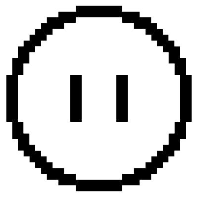

<p align="center">
  
</p>
<p align="center">
    <h1 align="center">BEATBLOCK-AI</h1>
</p>
<p align="center">
	
	
	
</p>
<p align="center">
		<em>Built with the tools and technologies:</em>
</p>
<p align="center">
	
	
	
	
	
	<br>
	
	
	
	
	
</p>

<br>

#####  Table of Contents

- [ Overview](#-overview)
- [ Features](#-features)
- [ Repository Structure](#-repository-structure)
- [ Modules](#-modules)
- [ Getting Started](#-getting-started)
    - [ Prerequisites](#-prerequisites)
    - [ Installation](#-installation)
    - [ Usage](#-usage)
- [ Contributing](#-contributing)

---

##  Overview

The BeatBlock-AI project is an advanced software system tailored for real-time object detection within gaming environments. Central to its functionality is the `predictv9.py` script, which leverages the power of the YOLOv5 framework for detecting and classifying various gaming elements such as Blocks, Inverse, Pipes, Sliders, Players, and Bombs directly from the games screen. This script is instrumental in capturing screen content via `mss`, processing it using potent libraries like `torch` for model inference and `cv2` (OpenCV) for image handling, thus ensuring high-performance and minimal latency essential for real-time applications. The associated `data.yaml` file meticulously defines the training and validation parameters, including image paths and class names, ensuring the model is precise in recognizing the specified categories. The combination of robust machine learning models, efficient image processing, and strategic real-time data handling makes BeatBlock-AI a potent tool for enhancing interactive gaming experiences by facilitating automated object detection and interaction, thereby enriching gameplay and providing developers with a powerful tool for game analysis and feature enhancement.

---

##  Features

|    | Feature            | Description                                                                                      |
|----|--------------------|--------------------------------------------------------------------------------------------------|
| ⚙️  | **Architecture**   | Utilizes Python for building an object detection system. Includes data handling and prediction scripts.  |
| 🔌 | **Integrations**   | Integrates with machine learning frameworks and image processing libraries such as PyTorch and OpenCV  |
| ⚡️ | **Performance**    | Based to run on a gpu compiled version of pytorch. |
| 📦 | **Dependencies**   | Heavy reliance on various Python libraries including `numpy`, `torch`, and `opencv-python`.  |

---
##  Repository Structure
```
└── beatblock-AI/
    ├── README.md
    ├── data.yaml
    ├── predictv9.py
    ├── requirements.txt
    ├── runs
    │   └── train
    │       └── beatblockv52
    └── yolov5s.pt
```

---

##  Modules

<details closed><summary>.</summary>

| File | Summary |
| --- | --- |
| [data.yaml](https://github.com/KillaMeep/beatblock-AI/blob/main/data.yaml) | Defines the training and validation image paths, sets the number of classes to six, and lists specific class names related to objects in BeatBlock AIs target detection system, ensuring the model trains on and recognizes these distinct categories. |
| [predictv9.py](https://github.com/KillaMeep/beatblock-AI/blob/main/predictv9.py) | The `predictv9.py` file is a crucial component of the `beatblock-AI` repository, serving primarily as the prediction and detection module for various game elements within a real-time environment. Utilizing models trained in the repositorys YOLOv5 framework (`yolov5s.pt`), this script is responsible for capturing screen content, processing it to detect objects, and classifying them into predefined categories such as Block, Inverse, Pipe, Slider, Player, and Bomb. The identified objects are visually annotated with distinct colors for easy recognition.Moreover, the inclusion of comprehensive dependencies such as `torch`, `cv2` (OpenCV), `numpy`, and others suggests that the script is intensively utilizing computer vision techniques, machine learning inference, and possibly real-time interaction via the game's window managed by modules like `pygetwindow` and `ctypes`. The usage of `mss` for screen capture indicates the need for high-performance operations, likely to ensure minimal latency in real-time scenarios.The script also sets up a logging framework to facilitate debugging and monitoring of the detection process, thereby aiding in maintaining robust operational visibility during execution. This setup points to a larger architecture focused on real-time AI inference, where rapid processing and accurate detection are critical for effective functioning. Overall, `predictv9.py` is fundamental in bridging the game environment with AI-driven interactions, making it a centerpiece of this AI-integrated gaming framework. |
| [yolov5s.pt](https://github.com/KillaMeep/beatblock-AI/blob/main/yolov5s.pt) | Stores the pre-trained YOLOv5s model, integral for initializing the network with learned features for enhanced object detection capabilities in the BeatBlock AI system, facilitating improved predictability and performance in visual recognition tasks related to the projects scope. |
| [requirements.txt](https://github.com/KillaMeep/beatblock-AI/blob/main/requirements.txt) | The file `requirements.txt` within the `beatblock-AI` repository serves as a crucial component in defining the environment setup necessary for running the software successfully. It lists specific versions of Python packages that the application depends on, ensuring consistency and compatibility across different development and production environments. This file supports the main functionality of the repository, which likely involves AI or machine learning, given the inclusion of a model file (`yolov5s.pt`) and a Python script (`predictv9.py`) designed for predictions.The dependencies specified, such as `boto3` and `botocore`, suggest interactions with AWS services, potentially for managing storage or computation resources. Libraries like `absl-py` and `cloudpickle` indicate usage in a possibly complex data handling and computational context, which aligns with typical requirements for machine learning applications. The presence of `certifi` and `chardet` highlights an emphasis on secure and reliable data exchanges, which is essential for applications dealing with data over networks.Overall, this file ensures that all necessary Python libraries are installed and maintained at correct versions to prevent conflicts and issues during the execution of the AI functionalities provided by the repository. This aligns with the broader architectural role of facilitating machine learning predictions, likely on image data, given the specific mention of a YOLO model (`yolov5s.pt`). |
| [hyp.yaml](https://github.com/KillaMeep/beatblock-AI/blob/main/runs/train/beatblockv52/hyp.yaml) | Defines hyperparameters for training models in the Beatblock-AI project, setting values such as learning rates, momentum, and augmentation specifics crucial for optimizing the performance of the machine learning models utilized for image recognition and analysis. |
| [opt.yaml](https://github.com/KillaMeep/beatblock-AI/blob/main/runs/train/beatblockv52/opt.yaml) | Defines configuration for a YOLOv5-based object detection setup in the `beatblock-AI` project, including paths to model weights, dataset, hyperparameters, and training details like learning rates, epochs, and batch sizes to optimize detection performance on a specified GPU environment. |
| [best.pt](https://github.com/KillaMeep/beatblock-AI/blob/main/runs/train/beatblockv52/weights/best.pt) | Houses the trained model weights optimized during the training phase, pivotal for the Beatblock-AIs capability to accurately predict or classify data, directly influencing the performance and accuracy of the predictions generated by predictv9.py in real-world applications. |
| [last.pt](https://github.com/KillaMeep/beatblock-AI/blob/main/runs/train/beatblockv52/weights/last.pt) | Stores the final trained model weights for the Beatblock-AI project, essential for deploying the AIs capabilities in real-world applications. These weights represent the culmination of training processes, optimizing the performance of image recognition tasks specified in the projects architecture. |

</details>

---

##  Getting Started

###  Prerequisites

**Python**: `>3.10`

###  Installation

Build the project from source:

1. Clone the beatblock-AI repository:
```sh
git clone https://github.com/KillaMeep/beatblock-AI
```

2. Navigate to the project directory:
```sh
cd beatblock-AI
```

3. Install the required dependencies:
```sh
pip3 install -r requirements.txt
```

###  Usage

To run the project, execute the following command:

```sh
python3 predictv9.py
```


##  Contributing

Contributions are welcome! Here are several ways you can contribute:

- **[Report Issues](https://github.com/KillaMeep/beatblock-AI/issues)**: Submit bugs found or log feature requests for the `beatblock-AI` project.
- **[Join the Discussions](https://github.com/KillaMeep/beatblock-AI/discussions)**: Share your insights, provide feedback, or ask questions.

<details closed>
<summary>Contributing Guidelines</summary>

1. **Fork the Repository**: Start by forking the project repository to your github account.
2. **Clone Locally**: Clone the forked repository to your local machine using a git client.
   ```sh
   git clone https://github.com/KillaMeep/beatblock-AI
   ```
3. **Create a New Branch**: Always work on a new branch, giving it a descriptive name.
   ```sh
   git checkout -b new-feature-x
   ```
4. **Make Your Changes**: Develop and test your changes locally.
5. **Commit Your Changes**: Commit with a clear message describing your updates.
   ```sh
   git commit -m 'Implemented new feature x.'
   ```
6. **Push to github**: Push the changes to your forked repository.
   ```sh
   git push origin new-feature-x
   ```
7. **Submit a Pull Request**: Create a PR against the original project repository. Clearly describe the changes and their motivations.
8. **Review**: Once your PR is reviewed and approved, it will be merged into the main branch. Congratulations on your contribution!
</details>

<details closed>
<summary>Contributor Graph</summary>
<br>
<p align="left">
   <a href="https://github.com{/KillaMeep/beatblock-AI/}graphs/contributors">
      
   </a>
</p>
</details>

---

